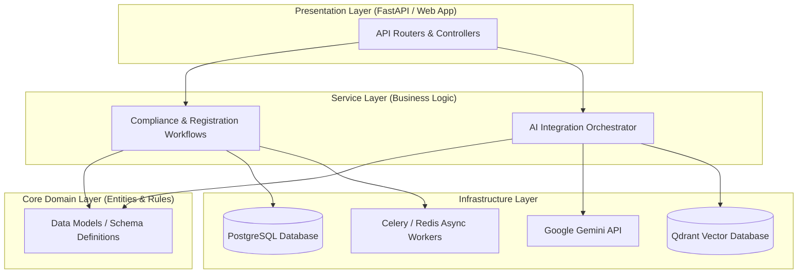

# Civora AI — Enterprise Architecture Design Specification

This document details the system architecture and technical design specifications for **Civora AI**, an AI-powered Government Compliance Operating System.

---

## 🗺️ Architectural Pattern: Clean (Onion) Architecture

Civora AI uses a **Clean Architecture** pattern to guarantee that business logic (compliance rules, workflow state machines) is decoupled from external tools, frameworks, and databases.

### Dependency Rules
* **Core Domain** has zero dependencies on other layers. It dictates the pure representation of business entities (e.g., Company, ComplianceRequirement).
* **Service Layer** coordinates operations but remains agnostic of database specifics.
* **Presentation Layer** interacts with services via predefined Pydantic schemas.
* **Infrastructure Layer** implements the interfaces defined by higher layers (e.g., executing DB transactions, calling Google Gemini SDK, storing vector embeddings).

---

## 🧱 Component Detail

### 1. API Routing (`backend/app/api`)
Handles incoming HTTP requests, session management, and HTTP exceptions. It is purely request-response validation and controller mapping. No business calculations are executed here.

### 2. Core Config & Security (`backend/app/core`)
Centralized environment configuration management (Pydantic Settings), application logging configuration, and security helpers (JWT signing, encryption libraries).

### 3. Business Service Layer (`backend/app/services`)
Contains the application's domain logic:
* **Compliance Service**: Evaluates state-specific registration procedures.
* **Orchestration Service**: Merges structured database compliance criteria with contextual insights derived from AI.

### 4. Schema Definitions (`backend/app/schemas`)
Strict input-output typing using Pydantic. Ensures that API inputs are clean and safe before processing, serving as the application boundary contracts.

### 5. Repository Pattern (`backend/app/repository`)
Separates DB transaction code from the business services. Services communicate with the repository interface, allowing the database engine (e.g., PostgreSQL) to be swapped or mocked in unit tests easily.

### 6. Integrations (`backend/app/integrations`)
Encapsulates outward dependencies:
* **Gemini Client**: Formulates prompts and consumes the Google GenAI SDK.
* **Vector DB Client**: Performs semantic indexing on compliance textbooks, laws, and registration guides.

---

## 🤖 AI & RAG Orchestration Strategy

* **LLM Engine**: Google Gemini API is used via the official `google-genai` SDK.
* **Retrieval-Augmented Generation (RAG)**:
  * Static government registration handbooks and compliance requirements are chunked, embedded using sentence-transformers, and stored in **Qdrant Vector DB**.
  * When a user queries compliance processes, relevant legal clauses are retrieved and fed into Gemini as context to eliminate hallucination.
* **Hybrid Search**: Combines semantic embeddings with metadata filtering (e.g., filtering by State or Industry).

---

## 🔒 Security Design

1. **PII and Data Isolation**:
   * Personal identifiers (SSNs, EINs, names) are encrypted at rest using AES-256 (via the Python `cryptography` package).
2. **AI Prompt Isolation**:
   * All LLM inputs undergo sanitization to prevent prompt injection.
   * LLM responses are parsed strictly against Pydantic schemas using structured outputs to ensure type safety.
3. **Authentication**:
   * Stateless JWT tokens with short TTLs. Secure storage of passwords using `bcrypt`.

---

## ⚡ Scalability & Resilience

1. **Asynchronous Processing**:
   * Business incorporation filings or PDF generator pipelines are delegated to **Celery asynchronous workers** via a **Redis** message broker, keeping the FastAPI request thread pool clear.
2. **Caching Strategy**:
   * Common compliance milestones and statutory timelines are cached in Redis to decrease lookup times and limit downstream LLM API charges.
3. **Database Performance**:
   * Use of connection pooling (SQLAlchemy/PgBouncer) to ensure database queries perform reliably under high concurrent traffic.
