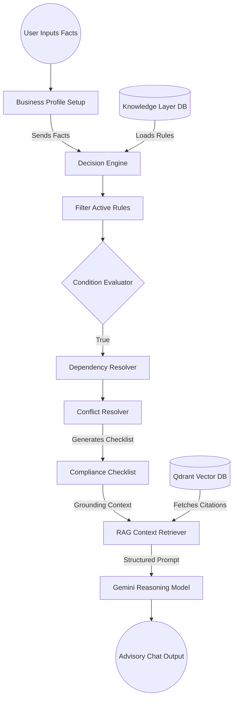

# Civora AI — Decision Layer Specification

This specification details the design, modules, evaluation flow, and conflict-resolution rules for the **Civora AI Decision Layer**.

---

## Part 1 — Policy Engine Philosophy

### What is a Policy Engine?
A **Policy Engine** is a deterministic evaluation environment that processes structured input facts against configured compliance rules to compute a final compliance checklist. It is a logical processor that answers questions like: *"Given this business type, location, and annual turnover, what registrations are required?"*

### Separating Knowledge from Decision-Making
Hardcoding regulatory business rules directly into application logic (e.g., nested `if/else` statements in backend API routers) is a common anti-pattern in legal technology. It couples coding logic with frequently changing state statutes.

Civora AI addresses this by segregating the stack:
* **The Knowledge Layer (Static)**: Models legal nodes, acts, and statutory definitions as immutable relational data.
* **The Decision Layer (Dynamic)**: Executes evaluation logic. It contains the execution algorithm that parses rules, resolves dependency order, matches state criteria, and returns decisions.

```
       +---------------------------------------------+
       |             User Inputs (Facts)             |
       +---------------------------------------------+
                              |
                              v
       +---------------------------------------------+
       |          Decision Layer Engine              |
       |  (Deterministic Logic Evaluation Core)      |
       +---------------------------------------------+
                              ^
                              | (Queries Rule Schemas)
       +---------------------------------------------+
       |      Knowledge Layer (JSON Data Rules)      |
       +---------------------------------------------+
```

By separating knowledge from evaluation:
1. **Zero-Code Policy Changes**: If a state raises its GST tax threshold, we update the state JSON rule file. The application code remains completely unchanged.
2. **Auditability**: Decisions are traceable. The policy engine outputs a step-by-step execution trace showing exactly which rules were matched and which conditions triggered a particular compliance task.
3. **Multi-Jurisdiction Adaptability**: The core engine remains identical whether evaluating Delaware corporate law or Maharashtra municipal guidelines.

---

## Part 2 — Decision Engine Architecture

The Decision Engine is partitioned into nine specialized modules, each maintaining a clear separation of concerns:

```
                  +-----------------------------------+
                  |         DECISION ENGINE           |
                  +-----------------------------------+
                                    |
      +-----------------------------+-----------------------------+
      |                             |                             |
      v                             v                             v
+-----------+                 +-----------+                 +-----------+
|Rule Engine|                 |Condition  |                 |Eligibility|
|           |                 |Evaluator  |                 |Engine     |
+-----------+                 +-----------+                 +-----------+
      |                             |                             |
      v                             v                             v
+-----------+                 +-----------+                 +-----------+
|Dependency |                 |Workflow   |                 |Conflict   |
|Resolver   |                 |Engine     |                 |Resolver   |
+-----------+                 +-----------+                 +-----------+
      |                             |                             |
      v                             v                             v
+-----------+                 +-----------+                 +-----------+
|Priority   |                 |Validation |                 |Policy     |
|Engine     |                 |Engine     |                 |State Log  |
+-----------+                 +-----------+                 +-----------+
```

1. **Decision Engine**: The primary orchestrator. It receives user inputs, aggregates necessary rule models from the Knowledge Layer, initializes the sub-engines, and compiles the final compliance decision tree.
2. **Rule Engine**: Evaluates active rule collections. It parses structured rule statements (If/Then actions) and filters out inactive or expired rules.
3. **Condition Evaluator**: The boolean processor. It evaluates operator conditions (e.g. `turnover >= 4000000`, `state == 'KA'`) against user facts.
4. **Eligibility Engine**: Resolves prerequisite qualifiers. It checks if the user's business category qualifies for exemptions before executing heavier compliance checks.
5. **Dependency Resolver**: Resolves execution order. For example, if License B requires License A, the resolver ensures License A is placed earlier in the wizard checklist.
6. **Workflow Engine**: Manages transitional states of filing tasks (e.g., verifying if a paid fee should trigger a notification action).
7. **Conflict Resolver**: Resolves overrides. If a state-level rule contradicts a central-level rule, it executes the resolution priority index.
8. **Priority Engine**: Sorts active rules by execution weights to ensure core steps (like incorporation) compile before optional steps (like trade markings).
9. **Validation Engine**: Performs real-time schema validation on rule files before ingestion to prevent malformed properties from breaking the parser.

---

## Part 4 — Decision Flow Diagram



---

## Part 5 — Rule Category Configurations

The policy engine categorizes rules to optimize retrieval and execution paths:

### 1. Business Rules
* **Description**: Dictates basic operational legality based on business activity.
* **Example**:
  ```json
  "condition": { "fact": "primary_activity_code", "operator": "equal", "value": "NIC-56210" },
  "action": { "type": "require_license", "params": { "license_uuid": "fssai-state-lic-uuid-placeholder" } }
  ```

### 2. State Rules
* **Description**: Localizes rules to a specific state jurisdiction.
* **Example**:
  ```json
  "applicable_state": "MH",
  "condition": { "fact": "entity_type", "operator": "equal", "value": "LLC" },
  "action": { "type": "charge_fee", "params": { "fee_uuid": "mh-llc-state-fee-uuid-placeholder" } }
  ```

### 3. Central Rules
* **Description**: Federal laws applying universally across all states.
* **Example**:
  ```json
  "applicable_state": "ALL",
  "condition": { "fact": "employee_count", "operator": "greaterThan", "value": 10 },
  "action": { "type": "require_license", "params": { "license_uuid": "epfo-registration-uuid" } }
  ```

### 4. Eligibility Rules
* **Description**: Evaluates basic qualifications.
* **Example**:
  ```json
  "condition": { "fact": "owner_age", "operator": "lessThan", "value": 18 },
  "action": { "type": "exempt_license", "params": { "license_uuid": "directorship-eligibility-uuid" } }
  ```

### 5. Fee Rules
* **Description**: Computes exact payment requirements.
* **Example**:
  ```json
  "condition": { "fact": "share_capital", "operator": "greaterThan", "value": 1000000 },
  "action": { "type": "charge_fee", "params": { "fee_uuid": "mca-high-capital-fee-uuid" } }
  ```

### 6. Renewal Rules
* **Description**: Schedules recurring validation dates.
* **Example**:
  ```json
  "condition": { "fact": "license_status", "operator": "equal", "value": "Active" },
  "action": { "type": "set_timeline", "params": { "timeline_uuid": "annual-renewal-reminder-uuid" } }
  ```

### 7. Penalty Rules
* **Description**: Evaluates fine accumulation for missed compliance deadlines.
* **Example**:
  ```json
  "condition": { "fact": "days_past_deadline", "operator": "greaterThan", "value": 0 },
  "action": { "type": "apply_penalty", "params": { "penalty_uuid": "mca-daily-late-penalty-uuid" } }
  ```

---

## Part 6 — Conflict Resolution Protocols

In federalized government infrastructures, central (national) laws frequently conflict with state or municipal rules. To resolve these logic conflicts without codebase alterations, the **Conflict Resolver** module applies a strict **Priority Hierarchy Index**:

```
+-------------------------------------------------------+
|  Level 1: Municipal/Local Rules (Applicable District)  | -> Highest Priority
+-------------------------------------------------------+
                           |
                           v
+-------------------------------------------------------+
|  Level 2: State-Specific Rules (Applicable State)     |
+-------------------------------------------------------+
                           |
                           v
+-------------------------------------------------------+
|  Level 3: Central/Federal Rules (Universal)           | -> Lowest Priority
+-------------------------------------------------------+
```

### Resolution Rules:
1. **Specific Overrides General**: If a state rule defines a fee of INR 500 for a license, and a central rule sets it to INR 200, the state rule takes precedence for businesses operating within that state.
2. **Explicit Override Property**: Every rule file supports an optional `overrides` array that explicitly references rule IDs it is intended to deactivate:
   ```json
   {
     "id": "state-rule-mh-01",
     "overrides": ["central-rule-in-09"],
     "description": "Maharashtra State explicitly exempts food vendors from central packing licenses."
   }
   ```
3. **Execution Masking**: When a rule ID listed in the `overrides` array triggers successfully, the Conflict Resolver masks the overridden rule, preventing it from executing.

---

## Part 7 — Scaling to 100,000+ Rules

To prevent performance degradation as the rule repository grows to scale, the execution path is optimized through **Rete-Algorithm-Style Fact Indexing**:

* **Fact-Based Graph Partitioning**: Rules are indexed by the input parameters they depend on (e.g. `state`, `turnover`, `industry`). If a user sets their state to "Karnataka" and industry to "Retail", the decision engine loads only the subset of rules matching those index coordinates, skipping unrelated files.
* **Compilation Cache**: Rules are pre-compiled into memory trees at startup, avoiding file reads during user evaluation steps.
* **Stateless Lambda Execution**: The evaluation core is completely stateless. Facts are passed as input payloads and processed through the memory trees in sub-milliseconds, allowing the engine to scale horizontally across serverless workers.

---

## Part 8 — Inter-Layer Communication Interface

The system components interact via clean, decoupled communication boundaries:

```
+---------------------+              +---------------------+
|   Knowledge Layer   | -----------> |   Decision Layer    |
| (Returns JSON Rules)|              | (Evaluates Rules)   |
+---------------------+              +---------------------+
                                                |
                                                v (Checklist Payload)
+---------------------+              +---------------------+
|     Gemini LLM      | <----------- |      Retriever      |
|  (Explains Rules)   |              | (Injects Citations) |
+---------------------+              +---------------------+
```

1. **Knowledge to Decision**: The Decision Engine queries the Knowledge Layer to retrieve active rules and schemas matching the user's business profile.
2. **Decision to Retriever**: Once rules are evaluated, the Decision Layer sends a structured checklist payload to the Retriever (e.g., `[{"rule_matched": "BR-01", "required_license": "FSSAI"}]`).
3. **Retriever to Gemini**: The Retriever fetches the exact statutory text chunks matching the checklist payload and passes them as grounding context to the Gemini model.
4. **Gemini to User**: Gemini synthesizes the structured checklist and legal citations into plain English, delivering an explainable, factually-grounded advisory response to the user.
