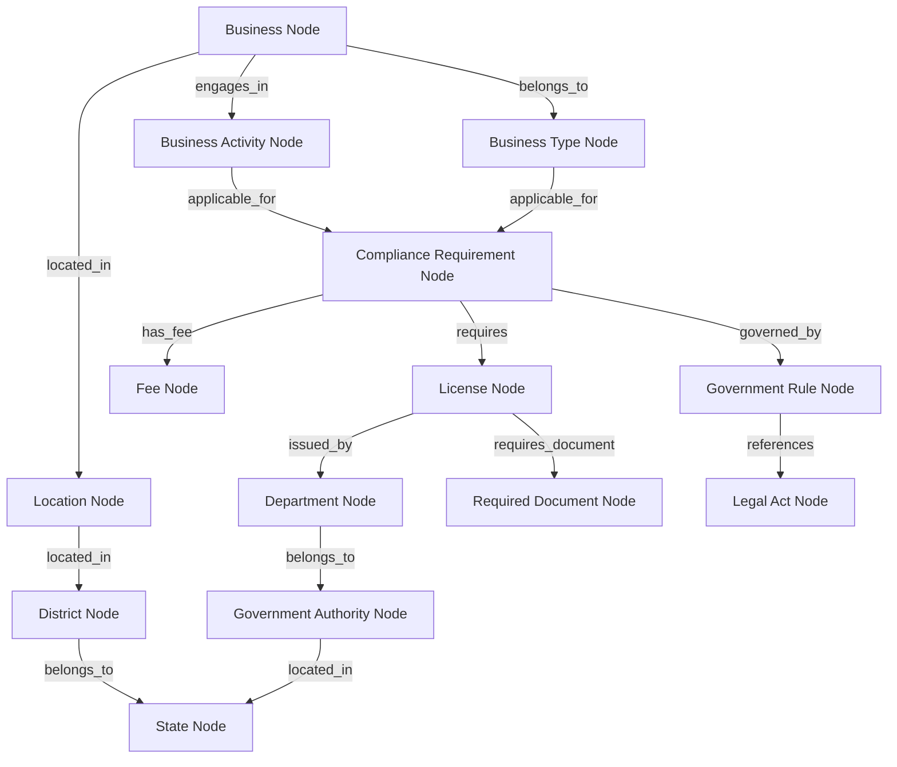
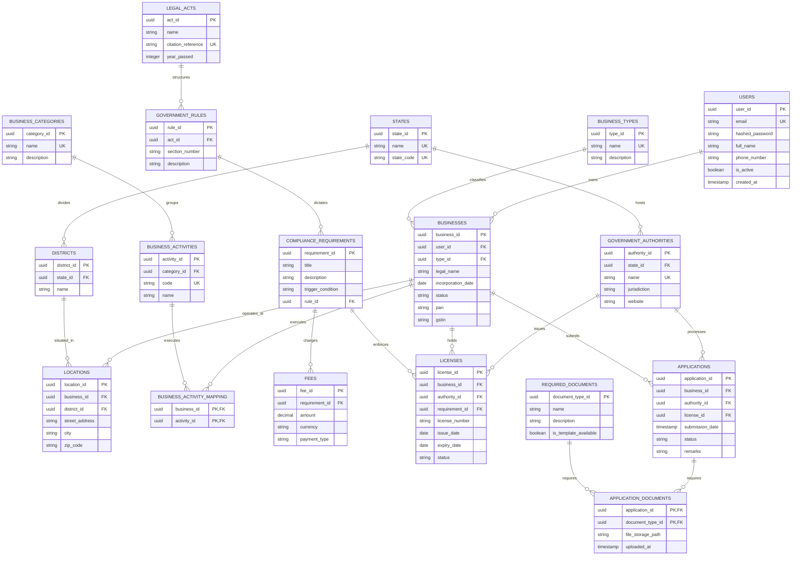
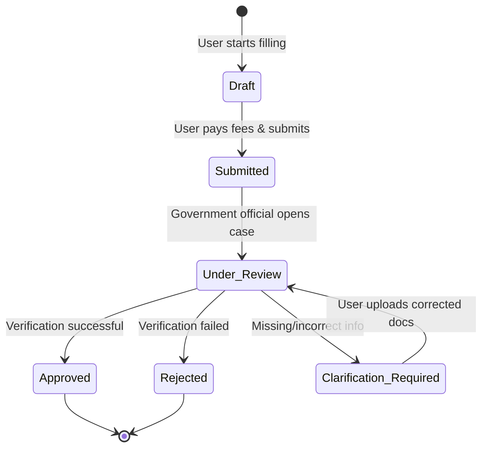
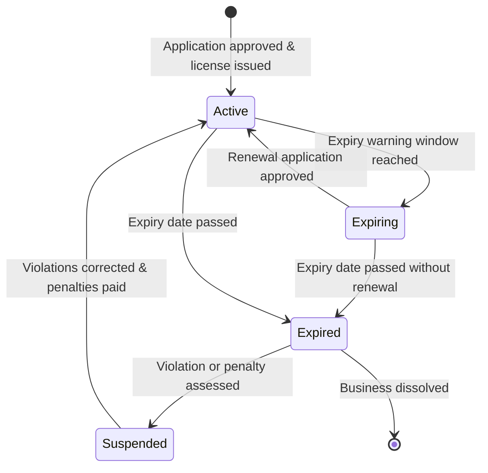

# Civora AI — Domain Model & Knowledge Engine Design Specification

This document details the blueprint for the core Domain Model, Knowledge Engine, Database Entity-Relationship model, and compliance rules of **Civora AI**.

---

## Part 1 — Domain Model

Below are the definitions for the core business entities forming our Domain Model.

### 1. User
* **Purpose**: Represents any citizen or entrepreneur accessing the system.
* **Responsibilities**: Auths, profiles setup, ownership of businesses.
* **Attributes**: `user_id` (UUID), `email` (string), `hashed_password` (string), `full_name` (string), `phone_number` (string), `is_active` (boolean), `created_at` (datetime).
* **Relationships**: Has one-to-many relationship with **Business** and **Notification**.
* **Constraints**: Email must be unique and valid.

### 2. Business
* **Purpose**: Represents a specific commercial entity registered or being registered by a User.
* **Responsibilities**: Tracks business attributes, active registrations, locations, and compliance states.
* **Attributes**: `business_id` (UUID), `legal_name` (string), `entity_type_id` (UUID), `incorporation_date` (date), `status` (string), `pan` (string, optional), `gstin` (string, optional).
* **Relationships**: Belongs to **User**. Has many **Locations**, **Applications**, and **Licenses**.
* **Constraints**: Legal name must be unique within a state registry.

### 3. Business Category
* **Purpose**: Classifies businesses by broad industry sector (e.g. Retail, Food & Beverage, Fintech).
* **Responsibilities**: Clusters similar business activities for compliance grouping.
* **Attributes**: `category_id` (UUID), `name` (string), `description` (string).
* **Relationships**: Has many **Business Activities**.
* **Constraints**: Category name must be unique.

### 4. Business Type
* **Purpose**: Defines legal entities (e.g. LLC, C-Corp, Partnership, Private Limited).
* **Responsibilities**: Dictates basic incorporation requirements, bylaws/operating agreement structures.
* **Attributes**: `type_id` (UUID), `name` (string), `description` (string).
* **Relationships**: Relates to **Business** and state-level registration steps.
* **Constraints**: Name must be unique.

### 5. License
* **Purpose**: Represents an official operating permission held by a Business.
* **Responsibilities**: Tracks validity, expiration, and status of permissions.
* **Attributes**: `license_id` (UUID), `license_number` (string), `issue_date` (date), `expiry_date` (date), `status` (string).
* **Relationships**: Belongs to **Business** and **Government Authority**. References a **Compliance Requirement**.
* **Constraints**: Expiry date must be greater than issue date.

### 6. Registration
* **Purpose**: Tracks formal government enrollment actions (e.g., GST registration, EIN registration).
* **Responsibilities**: Records official identifier codes and credentials.
* **Attributes**: `registration_id` (UUID), `registration_number` (string), `registered_date` (date), `status` (string).
* **Relationships**: Belongs to **Business**, issued by **Government Authority**.
* **Constraints**: Registration number is unique within the authority system.

### 7. Government Authority
* **Purpose**: Represents a sovereign governing entity (e.g., IRS, Ministry of Corporate Affairs).
* **Responsibilities**: Enforces legal acts, issues licenses, processes applications.
* **Attributes**: `authority_id` (UUID), `name` (string), `jurisdiction` (string), `website` (string).
* **Relationships**: Has many **Departments**, **Licenses**, and **Applications**.
* **Constraints**: Name must be unique.

### 8. Department
* **Purpose**: Represents a sub-division of a Government Authority (e.g. Licensing Wing, Tax Audit division).
* **Responsibilities**: Evaluates specific compliance steps.
* **Attributes**: `department_id` (UUID), `name` (string), `contact_email` (string).
* **Relationships**: Belongs to **Government Authority**.
* **Constraints**: Department name unique within an authority.

### 9. Legal Act
* **Purpose**: Represents statutory legislation (e.g., Delaware General Corporation Law, Food Safety Act).
* **Responsibilities**: Grounds regulatory compliance rules with official legal authority.
* **Attributes**: `act_id` (UUID), `name` (string), `citation_reference` (string), `year_passed` (integer).
* **Relationships**: Dictates **Government Rules** and **Compliance Requirements**.
* **Constraints**: Citation reference must be unique.

### 10. Government Rule
* **Purpose**: Specific administrative regulations formulated under a Legal Act (e.g., Rule 144 on share transfers).
* **Responsibilities**: Defines active operational constraints.
* **Attributes**: `rule_id` (UUID), `section_number` (string), `description` (string).
* **Relationships**: Belongs to **Legal Act**. Sets the constraints for **Compliance Requirements**.
* **Constraints**: Unique section number per Act.

### 11. Required Document
* **Purpose**: Defines templates/records required for submission (e.g., Owner Photo ID, Lease Agreement).
* **Responsibilities**: Models file specifications, sizes, and templates.
* **Attributes**: `document_type_id` (UUID), `name` (string), `description` (string), `is_template_available` (boolean).
* **Relationships**: Needed by **Applications** and **Licenses**.
* **Constraints**: File types restricted to PDF, JPEG, PNG.

### 12. Application
* **Purpose**: Tracks submission transactions to acquire a License or Registration.
* **Responsibilities**: Manages status lifecycles, submission logs, and approval tracking.
* **Attributes**: `application_id` (UUID), `submission_date` (datetime), `status` (string), `remarks` (string).
* **Relationships**: Submitted by **Business** for a **License** type. Has many **Required Documents**.
* **Constraints**: Cannot submit if duplicate active application exists.

### 13. Compliance Requirement
* **Purpose**: Abstract condition that a business must satisfy (e.g., Minimum capital of $10,000).
* **Responsibilities**: Maps rules to active business parameters.
* **Attributes**: `requirement_id` (UUID), `title` (string), `description` (string), `trigger_condition` (string).
* **Relationships**: Governed by **Government Rules**. Connected to **Business Activities** and **Business Types**.
* **Constraints**: Trigger condition must parse to boolean logic.

### 14. Fee
* **Purpose**: Represents filing charges, license fees, or tax payments.
* **Responsibilities**: Tracks standard cost configurations.
* **Attributes**: `fee_id` (UUID), `amount` (decimal), `currency` (string), `payment_type` (string).
* **Relationships**: Has one-to-one relationship with **Application** or **Compliance Requirement**.
* **Constraints**: Amount cannot be negative.

### 15. Timeline
* **Purpose**: Defines regulatory durations (e.g. 15-day processing window, 30-day grace period).
* **Responsibilities**: Controls calculation of deadlines and status alerts.
* **Attributes**: `timeline_id` (UUID), `duration_days` (integer), `milestone_event` (string).
* **Relationships**: Linked to **Compliance Requirements** and **Applications**.
* **Constraints**: Duration must be positive.

### 16. Penalty
* **Purpose**: Defines punitive fees or actions for non-compliance (e.g. $10/day fine).
* **Responsibilities**: Calculates active liabilities if deadlines are missed.
* **Attributes**: `penalty_id` (UUID), `amount` (decimal), `rate_type` (string), `description` (string).
* **Relationships**: Linked to **Compliance Requirements** and **Timelines**.
* **Constraints**: Triggered only after Timeline expiry.

### 17. Notification
* **Purpose**: System-generated alerts informing users of upcoming events.
* **Responsibilities**: Dispatches emails/push alerts for deadlines.
* **Attributes**: `notification_id` (UUID), `message` (string), `status` (string), `sent_at` (datetime).
* **Relationships**: Belongs to **User**. References a **Compliance Requirement**.
* **Constraints**: Must fail gracefully if notification service times out.

### 18. Location
* **Purpose**: Defines a physical or registered address of a Business.
* **Responsibilities**: Controls geographical compliance matching (jurisdictions).
* **Attributes**: `location_id` (UUID), `street_address` (string), `city` (string), `zip_code` (string).
* **Relationships**: Belongs to **Business**, maps to **State** and **District**.
* **Constraints**: Zip code must match standard format.

### 19. State
* **Purpose**: Represents primary sub-national state government jurisdiction.
* **Responsibilities**: Sets state laws and registry fees.
* **Attributes**: `state_id` (UUID), `name` (string), `state_code` (string).
* **Relationships**: Has many **Districts** and **Government Authorities**.
* **Constraints**: State code must be unique (e.g., DE, WY, TX).

### 20. District
* **Purpose**: Represents municipal/local district divisions.
* **Responsibilities**: Directs local license requirements (e.g. trade licenses).
* **Attributes**: `district_id` (UUID), `name` (string).
* **Relationships**: Belongs to **State**. Has many **Locations**.
* **Constraints**: Name unique within a state.

### 21. Renewal
* **Purpose**: Represents recurring compliance events.
* **Responsibilities**: Calculates future expiry and next due dates.
* **Attributes**: `renewal_id` (UUID), `recurrence_interval_months` (integer).
* **Relationships**: Linked to **License** and **Compliance Requirement**.
* **Constraints**: Recurrence must be greater than zero.

### 22. Business Activity
* **Purpose**: Defines specific operations (e.g. selling liquor, online consulting).
* **Responsibilities**: Triggers specific industrial compliance codes.
* **Attributes**: `activity_id` (UUID), `code` (string), `name` (string).
* **Relationships**: Belongs to **Business Category**. Maps to **Compliance Requirements**.
* **Constraints**: Activity code must be unique (e.g., NAICS/NIC codes).

### 23. Approval
* **Purpose**: Tracks formal sign-off from officials.
* **Responsibilities**: Moves application states from pending to approved.
* **Attributes**: `approval_id` (UUID), `approved_by` (string), `approved_at` (datetime).
* **Relationships**: Belongs to **Application**.
* **Constraints**: Approval date must be after application submission.

### 24. Inspection
* **Purpose**: Records physical audits or field visits.
* **Responsibilities**: Stores audit scores and compliance logs.
* **Attributes**: `inspection_id` (UUID), `scheduled_date` (date), `status` (string), `findings` (string).
* **Relationships**: Linked to **Application** and **Government Authority**.
* **Constraints**: Can only schedule for active business sites.

---

## Part 2 — Knowledge Graph

### Graph Connections Diagram

### Relationship Explanations

1. **`belongs_to`**: Specifies classification hierarchies (e.g., a Business belongs to a Business Type; a District belongs to a State).
2. **`located_in`**: Pinpoints physical location nodes to calculate geographic tax and licensing jurisdictions.
3. **`engages_in`**: Links active commercial tasks to regulatory triggers.
4. **`applicable_for`**: Defines the conditions under which a Compliance Requirement is active (e.g., turning over a certain amount triggers tax filing requirements).
5. **`requires`**: Establishes dependencies where a Compliance Requirement obligates the holding of a License.
6. **`issued_by`**: Matches licenses to the specific department handling reviews and approvals.
7. **`requires_document`**: Specifies attachments and filings that must be submitted to secure a License.
8. **`has_fee`**: Links requirements and filings to structural Fee cost nodes.
9. **`governed_by`**: Connects operational requirements to administrative rules.
10. **`references`**: Roots administrative rules back to the originating Legal Act.

---

## Part 4 — Database Design

### Entity-Relationship Diagram

### Normalization & Scalability Architecture

1. **Normal Form Strategy**: The schema is designed in **Third Normal Form (3NF)**:
   * All tables have primary keys.
   * No non-key attributes depend on anything other than the primary key (eliminating transitive dependencies).
   * Redundant fields (like state names inside local addresses) are abstracted into static tables (`STATES`, `DISTRICTS`).
2. **Many-to-Many Mappings**:
   * **`BUSINESS_ACTIVITY_MAPPING`**: Connects businesses to multiple business activities they engage in.
   * **`APPLICATION_DOCUMENTS`**: Links files uploaded by users to specific requested documents in application packets.
3. **Primary & Foreign Keys**: All tables use globally unique identifiers (`UUIDv4`) for primary keys. This prevents ID exhaustion, improves security (preventing sequential scanning), and enables simple database shards across geographic state instances.

---

## Part 5 — Domain Events

The system publishes the following domain events during compliance cycles:

1. **`UserRegisteredEvent`**: Fired when a new user signs up.
2. **`BusinessCreatedEvent`**: Fired when a business profile is initialized.
3. **`BusinessIncorporatedEvent`**: Fired when incorporation steps complete.
4. **`BusinessLocationAddedEvent`**: Fired when a physical shop address is registered.
5. **`BusinessActivityUpdatedEvent`**: Fired when industry parameters change.
6. **`ComplianceRequirementTriggeredEvent`**: Fired when rules engine matches a state threshold.
7. **`LicenseRequirementIdentifiedEvent`**: Fired when a license is determined mandatory.
8. **`ApplicationDraftedEvent`**: Fired when a filing application is started.
9. **`DocumentUploadedEvent`**: Fired when a required PDF is attached.
10. **`DocumentRejectedEvent`**: Fired when an inspector rejects an uploaded file.
11. **`ApplicationSubmittedEvent`**: Fired when filing is dispatched to an authority.
12. **`FeeCalculationCompletedEvent`**: Fired when tax or government fees are totaled.
13. **`FeePaidEvent`**: Fired when filing transaction records update.
14. **`ApplicationUnderReviewEvent`**: Fired when an official starts reviewing files.
15. **`InspectionScheduledEvent`**: Fired when an on-site audit is set.
16. **`InspectionCompletedEvent`**: Fired when the audit report is logged.
17. **`ApplicationApprovedEvent`**: Fired when approval is issued.
18. **`ApplicationRejectedEvent`**: Fired when a filing is rejected.
19. **`LicenseIssuedEvent`**: Fired when a license record goes active.
20. **`LicenseActiveEvent`**: Fired when active status is confirmed by registry.
21. **`LicenseExpiringEvent`**: Fired when a license approaches its warning window.
22. **`LicenseExpiredEvent`**: Fired when renewal deadlines pass.
23. **`RenewalDueEvent`**: Fired when renewal cycle kicks off.
24. **`PenaltyAssessedEvent`**: Fired when late filing fees accumulate.
25. **`NotificationDispatchedEvent`**: Fired when a notification alert is sent.

---

## Part 6 — Business Rules

Our compliance rule engine enforces these independent criteria:

* **BR-001 (Food Business Licensure)**: Any business activity with code beginning with `NIC-56` (Food & Beverage Services) must require an FSSAI Food Business License.
* **BR-002 (GST Threshold)**: If a business location's state is not a Special Category State, and estimated turnover exceeds INR 4,000,000 annually, the system must trigger a mandatory GST Registration requirement.
* **BR-003 (Special State GST)**: If the state is a Special Category State (e.g., Assam, Sikkim) and estimated turnover exceeds INR 2,000,000, GST Registration is required.
* **BR-004 (Local Trade License)**: Any business engaging in retail operations must require a Municipal Trade License issued by the District Authority matching the business location.
* **BR-005 (EIN Requirement)**: Any business type identified as a "C-Corporation" or employing more than 0 employees must trigger a Federal Employer ID (EIN) application.
* **BR-006 (Delaware Franchise Tax)**: Any business type identified as a "Delaware LLC" must resolve a Franchise Tax payment of $300 annually before June 1.
* **BR-007 (Audit Requirement)**: Any private limited company with paid-up share capital exceeding INR 5,000,000 must file annual audited accounts with the Ministry of Corporate Affairs.

---

## Part 7 — State Machines

### 1. Application Lifecycle State Diagram

### 2. License Lifecycle State Diagram

---

## Part 9 — Data Layer File System

The data directory tree under `data/` isolates files by operational ingestion phases:

* **`data/raw/government_pdfs/`**: Houses original, immutable statutory PDFs, act publications, and registration forms.
* **`data/raw/government_notifications/`**: Contains raw text transcripts of state amendments and gazettes.
* **`data/knowledge/businesses/`**: JSON configuration templates defining standard incorporation steps for each business type.
* **`data/knowledge/licenses/`**: Rule mapping structures indicating what documents and fees apply to what license types.
* **`data/knowledge/authorities/`**: Directory mapping ministry endpoints, contacts, and submission APIs.
* **`data/knowledge/legal_acts/`**: Metadata links referencing specific acts (DGCL, Income Tax Act).
* **`data/knowledge/states/`**: Configuration metadata defining state specific tax limits and special rules.
* **`data/processed/embeddings/`**: Vector index storage files containing computed embeddings of source regulations.
* **`data/processed/schemas/`**: Pydantic validation files validating inputs across API states.

---

## Part 10 — Scalability Architecture

To support millions of users and scale to all Indian States, ministries, and business types without code modifications, Civora AI uses **Data-Driven Configuration Scaling**:

1. **State Isolation via Tenant Configs**:
   * All state-specific variables (fees, forms, rules) are defined in configuration files inside `data/knowledge/states/` and loaded dynamically. Adding a new state (e.g., Karnataka) does not require changing backend routes; the registry loader parses `karnataka.json` and updates database nodes at start.
2. **Metadata-Driven Forms (Stripe-style)**:
   * Form wizard views are built dynamically using structured schemas. When a user requests a license application, the backend returns a JSON schema detailing the required fields, file formats, and validations. The frontend React wizard renders the form elements automatically from this JSON metadata.
3. **Vector Database Partitioning (Qdrant namespaces)**:
   * To handle millions of documents and languages efficiently, vector embedding spaces are partitioned using payload filters (e.g. `state_code`, `language`). This prevents search queries from traversing unrelated legal databases.
4. **Localization and Multi-Language Routing**:
   * Ingestion scripts load statutory translations. RAG prompts are mapped using language metadata keys, selecting translation contexts (e.g. Hindi, Tamil) before sending queries to Gemini.
