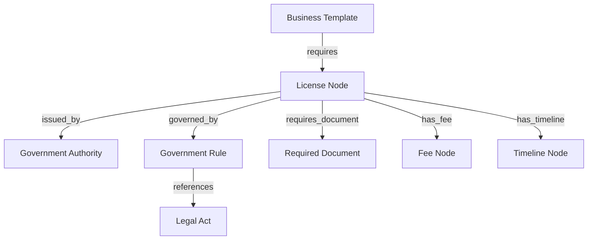

# Civora AI — Knowledge Layer Specification (Phase 1)

This specification establishes the structural architecture, metadata standards, collection workflows, validation rules, and integration adapters for the **Civora AI Knowledge Layer**.

---

## Part 1 — Knowledge Architecture & Philosophy

### Ingestion Philosophy: Structured Data vs. Raw PDFs
Traditional legal systems rely on indexing raw PDFs and executing semantic searches via Retrieval-Augmented Generation (RAG). While this works for conversational queries, it is insufficient for transactional compliance automation. PDFs are unstructured, layout-dependent, frequently amended, and lack programmatic referential integrity. 

Civora AI treats **Government Knowledge as Code**. Our architecture decomposes raw statutory publications into typed, validated, and normalized schema objects.

```
       +---------------------------------------------+
       |             Raw Government PDFs             |
       +---------------------------------------------+
                              |
                              v  (Ingestion & Parsing)
       +---------------------------------------------+
       |   Structured JSON Schemas & Validation      |
       +---------------------------------------------+
               |                             |
               v (Relational Graph)          v (Semantic RAG Context)
+-------------------------------+   +-------------------------------+
|  PostgreSQL Database Nodes    |   | Qdrant Vector Databases       |
+-------------------------------+   +-------------------------------+
```

* **Deterministic Rule Evaluation**: AI reasoning models hallucinate numerical figures and date offsets. Decomposing fees, timelines, and penalties into typed schema fields enables the application core to run deterministic policy checks (e.g. `due_date = incorporation_date + timeline_offset_days`).
* **Traceable Lineage**: Every configuration is linked directly to a verifiable government source citation.
* **Declarative Extensions**: Supporting a new state or municipal licensing rule does not require updating backend engines. It only requires dropping a valid JSON configuration into the schema-conforming directories.

---

## Part 2 — Knowledge Directory Structure

Compliance configurations are grouped inside the `data/knowledge/` tree to isolate concerns:

```
data/knowledge/
├── acts/          # Structural legal act references (e.g., Factories Act, 1948)
├── authorities/     # Directory of ministries, municipalities, and local councils
├── businesses/      # Pre-configured templates mapping industries to licenses
├── districts/       # Municipal district codes and mapping profiles
├── documents/       # Required filing templates, guidelines, and PDF formats
├── fees/            # Government application costs and processing fees
├── licenses/        # Operational permits and certificates rules
├── penalties/       # Late-filing fee rates and default suspensions
├── renewals/        # Expiration cycles and recurrent timeline mappings
├── rules/           # Administrative rules matching section coordinates
├── schemas/         # Draft-07 JSON schemas validating all data folders
├── sources/         # Digitized gazettes, notifications, and verification receipts
├── states/          # State parameters and geographic tax exemptions
├── templates/       # HTML/PDF templates for filing applications
├── timelines/       # Service Level Agreements (SLAs) for government review
└── validation/      # Automated shell scripts verifying json files
```

---

## Part 4 — Knowledge Object Metadata Standards

Every JSON node in the knowledge network must contain these fields to ensure auditability:

```json
{
  "uuid": "uuid-string",
  "version": "1.0.0",
  "last_updated": "date-time",
  "verification_status": "certified",
  "source": "uri-string",
  "applicable_state": "state-code",
  "applicable_district": "district-name",
  "confidence": 0.98,
  "tags": ["retail", "licensing"],
  "references": ["uri-string"],
  "dependencies": ["uuid-string"]
}
```

### Rationale for Metadata Fields:
1. **`uuid`**: Globally unique node identifier, preserving integrity during graph linking operations.
2. **`version`**: Implements semantic versioning (`major.minor.patch`) to track amendments in regulations.
3. **`last_updated`**: Log marking when the specific configuration was committed.
4. **`verification_status`**: Enforces peer-review state (`unverified` -> `extraction_verified` -> `expert_verified` -> `certified`).
5. **`source`**: Maps the data back to the primary source document schema.
6. **`applicable_state` / `applicable_district`**: Controls geographic routing filters.
7. **`confidence`**: Statistical probability score of the parsing accuracy.
8. **`tags`**: Broad categorization buckets.
9. **`references`**: Cross-citations referencing other related gazettes.
10. **`dependencies`**: Prevents parent execution if prerequisite nodes are missing.

---

## Part 5 — Source Verification Standards

To prevent false advice, every fact in the Civora system holds a `GovernmentSource` mapping:

1. **`official_url`**: Official government domain link (.gov.in / .gov) where the document is hosted.
2. **`publishing_department`**: Identifying the issuing officer or ministry (e.g. Ministry of Corporate Affairs).
3. **`notification_number` / `gazette_number`**: Official statutory identifiers verifying legal validity.
4. **`date_published`**: Statutory effective date of the notification.
5. **`date_verified`**: Audit log of when the extraction was verified.
6. **`verification_method`**: Method used for audit (`manual_double_check`, `api_cross_reference`, `expert_notary_signing`).
7. **`confidence_score`**: Score assigned based on source authority (e.g., official gazette = 1.0, secondary FAQ website = 0.5).

### Verification Workflow Pipeline:
```
[Ingestion Engine] -> [Extract Fact] -> [Confirm Official URL] 
                                                  |
                                                  v
[Write to Git Repo] <- [Expert Notary Check] <- [Cross Reference Gazette Num]
```

---

## Part 6 — Knowledge Validation Rules

The knowledge compiler executes these strict validation rules prior to committing files to production:

* **No Orphan Licenses**: Every license entity must map to at least one valid Government Authority UUID and one Government Rule UUID.
* **No Circular Dependencies**: A license cannot depend on another license that directly or indirectly depends on it.
* **Document Template Matching**: If `is_template_available` is true, the `template_url` field must not be null and must point to a valid file path.
* **Fee Calculation Bound**: Every Fee node must map to a target license, registration, or application transaction.
* **Rule Invariance**: Every administrative rule must reference a valid parent Legal Act UUID.
* **Timeline Resolution**: A license must point to an active statutory timeline specifying government processing SLAs.

---

## Part 7 — Knowledge Relationships

### Entity Connections



### Relationship Explanations
* **`requires`**: Establishes that operating an identified business category obligates securing that specific license.
* **`issued_by`**: Establishes administrative routing from the license to the reviewing government body.
* **`governed_by`**: Binds the permit to the specific legislative subsection dictating its issuance criteria.
* **`references`**: Roots the rule in national or state law.
* **`requires_document`**: Binds required attachments to the license filing packet.
* **`has_fee`**: Binds processing charges to the permit.
* **`has_timeline`**: Defines processing SLAs to alert users when timelines are exceeded.

---

## Part 8 — Government Knowledge Collection Strategy

The collection pipeline implements a systematic path from statutory source to verified production configuration:

```
+---------------------+      +---------------------+      +---------------------+
| 1. Source Gathering | ---> | 2. AI Extraction    | ---> | 3. Peer Validation  |
| (Government Web)    |      | (Gemini Parsing)    |      | (Legal Expert Sign) |
+---------------------+      +---------------------+      +---------------------+
                                                                     |
                                                                     v
+---------------------+      +---------------------+      +---------------------+
| 6. Production Ingest| <--- | 5. Schema Check     | <--- | 4. Serialization    |
| (Graph & Vector DB) |      | (JSON Schema Linter)|      | (Generate JSON file)|
+---------------------+      +---------------------+      +---------------------+
```

1. **Source Gathering**: Web scrapers monitor government circular portals and download PDF publications to `data/raw/`.
2. **AI Extraction**: An ingestion worker runs the PDF through Gemini using structured JSON mode to extract parameters matching the schema.
3. **Peer Validation**: A legal coordinator reviews the extracted parameters, comparing them against the original PDF.
4. **Serialization**: The verified object is committed as a structured JSON file in the target `data/knowledge/` subfolder.
5. **Schema Check**: Pre-commit CI/CD hooks run tests, validating the file against JSON schemas.
6. **Production Ingest**: The file is loaded into the production relational graph and vector space.

---

## Part 10 — System Integration

The modular design of this Knowledge Layer integrates cleanly with our other architecture components:

* **Policy Engine Integration**: The policy engine evaluates compliance status by querying Postgres using the static schema properties.
* **Retriever Integration**: The retriever utilizes the metadata tags (`applicable_state`, `tags`) to filter search results within Qdrant, improving retrieval precision.
* **Vector Database Ingestion**: Document chunks inherit their source metadata, allowing direct cross-queries between vector embeddings and relational nodes.
* **Knowledge Graph Resolution**: Node UUIDs serve as primary keys in Postgres tables, representing graph nodes, while link array attributes represent graph edges.
* **Gemini Grounding**: When answering user queries, the grounding engine retrieves matching JSON files and parses them into plain English strings before sending the final prompt to the model.
